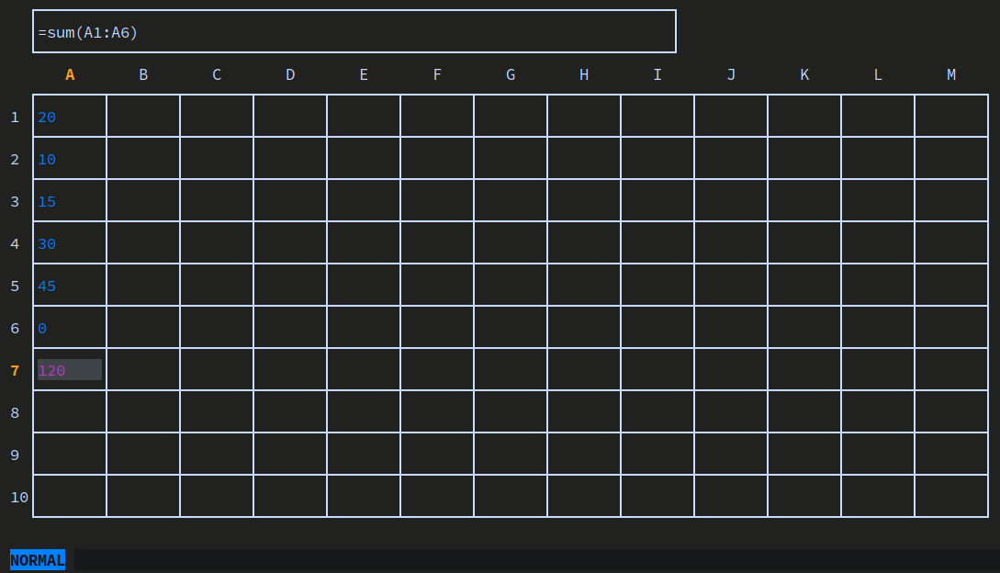

## Эксперементальный Excel для терминала

* `ui/` - код для пользовательского интерфейса
* `formula/` - интерпретатор формул
* `functions/` - набор функций
* `value/` - таблица данных, хранящая ячейки, объекты в помещенные в ячейки или полученные формулой

 Навигация стрелками или `h` `j` `k` `l`. Ввести значение в ячейку: `i`. Вернуться к навигации: `Esc`

> [!WARNING]
> На данный момент компилируется, но функционал доступен не полностью

